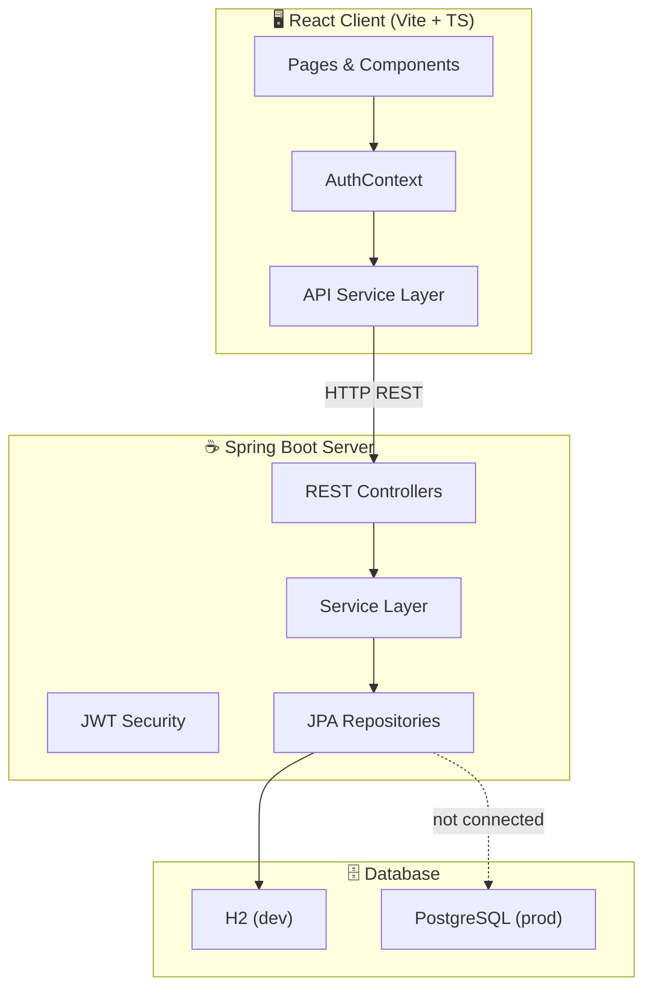
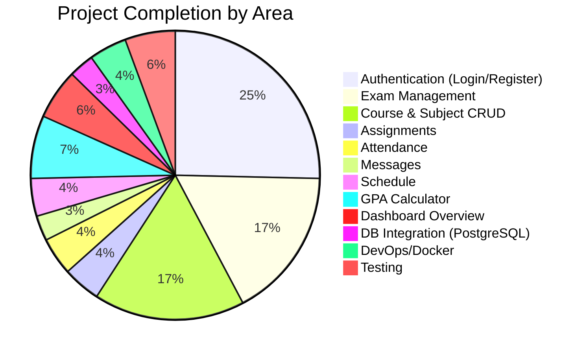

# 📊 Student Exam Dashboard — Complete Project Analysis

## Architecture Overview

This is a full-stack student dashboard application with a clear client-server separation:

| Layer | Technology | Status |
|-------|-----------|--------|
| **Frontend** | React 19 + TypeScript + Vite 7 + Tailwind CSS 4 | ~60% complete |
| **Backend** | Spring Boot 3.3.1 + Java 21 + Spring Security + JPA | ~45% complete |
| **Database** | H2 (in-memory, dev) / PostgreSQL (configured, not connected) | ~30% complete |
| **DevOps** | Dockerfile + docker-compose.yml | Scaffolded but untested |



---

## Frontend Analysis (Client)

### Tech Stack
- React 19.2 + TypeScript 5.9
- Vite 7.2 (dev server & bundler)
- Tailwind CSS 4.1 + @tailwindcss/forms
- React Router DOM 7.1 (routing)
- Lucide React (icons)

### Pages Implemented

| Page | File | Real API? | Status |
|------|------|-----------|--------|
| Login | [LoginPage.tsx](file:///c:/Users/SSN/OneDrive%20-%20SSN%20Trust/Pictures/Student%20dashboard/Client/src/pages/LoginPage.tsx) | ✅ Yes | ✅ Complete |
| Register | [RegisterPage.tsx](file:///c:/Users/SSN/OneDrive%20-%20SSN%20Trust/Pictures/Student%20dashboard/Client/src/pages/RegisterPage.tsx) | ✅ Yes | ✅ Complete |
| Overview | [Overview.tsx](file:///c:/Users/SSN/OneDrive%20-%20SSN%20Trust/Pictures/Student%20dashboard/Client/src/pages/Overview.tsx) | ❌ Hardcoded | ⚠️ Static mock data |
| Exams | [Exams.tsx](file:///c:/Users/SSN/OneDrive%20-%20SSN%20Trust/Pictures/Student%20dashboard/Client/src/pages/Exams.tsx) | ❌ Hardcoded | ⚠️ Static mock data |
| Assignments | [Assignments.tsx](file:///c:/Users/SSN/OneDrive%20-%20SSN%20Trust/Pictures/Student%20dashboard/Client/src/pages/Assignments.tsx) | ❌ Hardcoded | ⚠️ Static mock data |
| Attendance | [Attendance.tsx](file:///c:/Users/SSN/OneDrive%20-%20SSN%20Trust/Pictures/Student%20dashboard/Client/src/pages/Attendance.tsx) | ❌ Hardcoded | ⚠️ Static mock data |
| Schedule | [Schedule.tsx](file:///c:/Users/SSN/OneDrive%20-%20SSN%20Trust/Pictures/Student%20dashboard/Client/src/pages/Schedule.tsx) | ❌ Hardcoded | ⚠️ Static mock data |
| Messages | [Messages.tsx](file:///c:/Users/SSN/OneDrive%20-%20SSN%20Trust/Pictures/Student%20dashboard/Client/src/pages/Messages.tsx) | ❌ Hardcoded | ⚠️ Static mock data |
| GPA Calculator | [GPACalculator.tsx](file:///c:/Users/SSN/OneDrive%20-%20SSN%20Trust/Pictures/Student%20dashboard/Client/src/pages/GPACalculator.tsx) | ❌ Client-side only | ⚠️ No persistence |

### Components

| Component | File | Purpose | Status |
|-----------|------|---------|--------|
| LeftSidebar | [LeftSidebar.tsx](file:///c:/Users/SSN/OneDrive%20-%20SSN%20Trust/Pictures/Student%20dashboard/Client/src/components/LeftSidebar.tsx) | Navigation menu | ✅ Working |
| MainContent | [MainContent.tsx](file:///c:/Users/SSN/OneDrive%20-%20SSN%20Trust/Pictures/Student%20dashboard/Client/src/components/MainContent.tsx) | Content routing | ✅ Working |
| RightSidebar | [RightSidebar.tsx](file:///c:/Users/SSN/OneDrive%20-%20SSN%20Trust/Pictures/Student%20dashboard/Client/src/components/RightSidebar.tsx) | Calendar + upcoming exams | ⚠️ Hardcoded data |
| PrivateRoute | [PrivateRoute.tsx](file:///c:/Users/SSN/OneDrive%20-%20SSN%20Trust/Pictures/Student%20dashboard/Client/src/components/PrivateRoute.tsx) | Auth guard | ✅ Working |
| ResizeHandle | [ResizeHandle.tsx](file:///c:/Users/SSN/OneDrive%20-%20SSN%20Trust/Pictures/Student%20dashboard/Client/src/components/ResizeHandle.tsx) | Resizable panels | ✅ Working |

### Services & State Management

| File | What it does | Status |
|------|-------------|--------|
| [api.ts](file:///c:/Users/SSN/OneDrive%20-%20SSN%20Trust/Pictures/Student%20dashboard/Client/src/services/api.ts) | Axios API client with JWT interceptors, login/register endpoints | ⚠️ Only auth endpoints are wired |
| [AuthContext.tsx](file:///c:/Users/SSN/OneDrive%20-%20SSN%20Trust/Pictures/Student%20dashboard/Client/src/context/AuthContext.tsx) | JWT auth state, token storage in localStorage | ✅ Working |
| [useSidebarResizing.ts](file:///c:/Users/SSN/OneDrive%20-%20SSN%20Trust/Pictures/Student%20dashboard/Client/src/hooks/useSidebarResizing.ts) | Custom hook for resizable sidebars | ✅ Working |
| [dashboard.ts](file:///c:/Users/SSN/OneDrive%20-%20SSN%20Trust/Pictures/Student%20dashboard/Client/src/constants/dashboard.ts) | Sidebar nav items, status mappings | ✅ Working |
| [types/index.ts](file:///c:/Users/SSN/OneDrive%20-%20SSN%20Trust/Pictures/Student%20dashboard/Client/src/types/index.ts) | TypeScript type definitions | ⚠️ Minimal types defined |

> [!IMPORTANT]
> **Critical Frontend Gap:** All data-heavy pages (Exams, Assignments, Attendance, Schedule, Messages, Overview) use **hardcoded mock data** embedded directly in the components. There are **no API calls** for fetching this data from the backend. The API service file only has auth endpoints (login/register).

---

## Backend Analysis (Server)

### Package Structure

```
com.student.dashboard.server/
├── ServerApplication.java          ✅ Entry point
├── config/
│   ├── CorsConfig.java             ✅ CORS configuration
│   ├── OpenApiConfig.java          ✅ Swagger/OpenAPI docs
│   └── SecurityConfig.java         ✅ Spring Security + JWT filter chain
├── controller/
│   ├── AuthController.java         ✅ Login/Register endpoints
│   ├── ExamController.java         ✅ CRUD endpoints
│   ├── CourseController.java       ✅ CRUD endpoints
│   └── SubjectController.java      ✅ CRUD endpoints
├── dto/
│   ├── AuthRequest.java            ✅ Login DTO
│   ├── AuthResponse.java           ✅ JWT response DTO
│   ├── RegisterRequest.java        ✅ Registration DTO
│   ├── ExamDto.java                ✅ Exam DTO
│   ├── CourseDto.java              ✅ Course DTO
│   └── SubjectDto.java             ✅ Subject DTO
├── entity/
│   ├── User.java                   ✅ JPA Entity
│   ├── Course.java                 ✅ JPA Entity
│   ├── Subject.java                ✅ JPA Entity
│   ├── Exam.java                   ✅ JPA Entity
│   └── Enrollment.java            ✅ JPA Entity
├── exception/
│   └── GlobalExceptionHandler.java ✅ @ControllerAdvice
├── mapper/
│   ├── ExamMapper.java             ✅ MapStruct mapper
│   ├── CourseMapper.java           ✅ MapStruct mapper
│   └── SubjectMapper.java         ✅ MapStruct mapper
├── repository/
│   ├── UserRepository.java         ✅ JPA Repository
│   ├── CourseRepository.java       ✅ JPA Repository
│   ├── SubjectRepository.java      ✅ JPA Repository
│   ├── ExamRepository.java         ✅ JPA Repository
│   └── EnrollmentRepository.java   ✅ JPA Repository
├── security/
│   ├── JwtAuthFilter.java          ✅ JWT filter
│   ├── JwtService.java             ✅ Token generation/validation
│   └── CustomUserDetailsService.java ✅ UserDetails impl
└── service/
    ├── AuthService.java            ✅ Login + Register
    ├── ExamService.java            ✅ CRUD operations
    ├── CourseService.java          ✅ CRUD operations
    └── SubjectService.java        ✅ CRUD operations
```

### REST API Endpoints

| Endpoint | Method | Auth | Status |
|----------|--------|------|--------|
| `/api/auth/login` | POST | ❌ Public | ✅ Working |
| `/api/auth/register` | POST | ❌ Public | ✅ Working |
| `/api/exams` | GET | ✅ JWT | ✅ Implemented |
| `/api/exams/{id}` | GET | ✅ JWT | ✅ Implemented |
| `/api/exams` | POST | ✅ JWT | ✅ Implemented |
| `/api/exams/{id}` | PUT | ✅ JWT | ✅ Implemented |
| `/api/exams/{id}` | DELETE | ✅ JWT | ✅ Implemented |
| `/api/courses` | GET/POST/PUT/DELETE | ✅ JWT | ✅ Implemented |
| `/api/subjects` | GET/POST/PUT/DELETE | ✅ JWT | ✅ Implemented |

> [!WARNING]
> **Missing Backend APIs:** The following features visible in the frontend **have no backend API counterparts:**
> - ❌ Assignments CRUD
> - ❌ Attendance tracking
> - ❌ Messages/Chat
> - ❌ Schedule management
> - ❌ GPA/Grades
> - ❌ User profile management
> - ❌ Dashboard overview/statistics
> - ❌ Enrollment management endpoints

### Database Schema (Flyway Migrations)

The schema is well-designed with 8 tables across 2 migrations:

**V1 — Core Tables:** `users`, `courses`, `subjects`, `exams`, `enrollments`
**V2 — Additional Tables:** `assignments`, `attendance`, `messages`, `schedule_entries`

> [!NOTE]
> The database schema covers ALL features in the UI, but the **JPA entities, repositories, services, and controllers only exist for Users, Courses, Subjects, Exams, and Enrollments**. The tables `assignments`, `attendance`, `messages`, and `schedule_entries` have no corresponding Java code.

### Security
- JWT-based auth with access tokens (1hr) and refresh tokens (24hr)
- Spring Security filter chain with `JwtAuthFilter`
- Password hashing with BCrypt
- CORS configured for `http://localhost:5173` (Vite dev server)
- H2 console exposed at `/h2-console` (dev only)

### Infrastructure
- **Dockerfile** exists (multi-stage Maven build)
- **docker-compose.yml** configures PostgreSQL + the app
- Currently running on H2 in-memory database

---

## 📈 Overall Implementation Completeness



### Summary Scorecard

| Area | Frontend | Backend | DB Schema | Integration | Overall |
|------|----------|---------|-----------|-------------|---------|
| **Auth** | ✅ 90% | ✅ 90% | ✅ 100% | ✅ Connected | **~90%** |
| **Exams** | ⚠️ 70% (mock data) | ✅ 80% | ✅ 100% | ❌ Not wired | **~55%** |
| **Courses** | ❌ 0% (no UI) | ✅ 80% | ✅ 100% | ❌ N/A | **~30%** |
| **Subjects** | ❌ 0% (no UI) | ✅ 80% | ✅ 100% | ❌ N/A | **~30%** |
| **Assignments** | ⚠️ 60% (mock) | ❌ 0% | ✅ 100% | ❌ None | **~20%** |
| **Attendance** | ⚠️ 60% (mock) | ❌ 0% | ✅ 100% | ❌ None | **~20%** |
| **Messages** | ⚠️ 60% (mock) | ❌ 0% | ✅ 100% | ❌ None | **~20%** |
| **Schedule** | ⚠️ 60% (mock) | ❌ 0% | ✅ 100% | ❌ None | **~20%** |
| **GPA Calc** | ⚠️ 70% (client-only) | ❌ 0% | ❌ 0% | ❌ None | **~15%** |
| **Overview** | ⚠️ 50% (mock) | ❌ 0% | ❌ N/A | ❌ None | **~15%** |

> **Estimated Overall Completion: ~35-40%**

---

## 🔴 Critical Gaps to Address

### 1. Frontend-Backend Disconnect (HIGH PRIORITY)
The biggest issue: **only Login/Register pages talk to the backend**. Every other page uses hardcoded arrays of mock data.

### 2. Missing Backend Services for 4 Tables (HIGH PRIORITY)
Database tables exist for `assignments`, `attendance`, `messages`, `schedule_entries` but there are **no Entities, Repositories, Services, Controllers, DTOs, or Mappers** for them.

### 3. No Production Database Connection (MEDIUM PRIORITY)
Currently using H2 in-memory DB. PostgreSQL driver and Flyway are in pom.xml but the `application.yml` is configured for H2.

### 4. No Data Seeding (MEDIUM PRIORITY)
No initial data is loaded. After login, all pages would show empty data even if APIs were connected.

### 5. Missing Error Handling in Frontend (MEDIUM PRIORITY)
No loading states, error boundaries, or toast notifications when API calls fail.

### 6. No Role-Based Access Control (LOW-MEDIUM)
The `users` table has a `role` column, and Spring Security is set up, but there's no role-based authorization (e.g., admin vs student views).

---

## 🚀 Recommended Additional Features

### Must-Have (to make it production-ready)
1. **Token Refresh Flow** — Frontend token refresh interceptor + backend refresh endpoint
2. **User Profile Page** — View/edit profile, change password
3. **Pagination & Sorting** — Spring Data Pageable for all list endpoints
4. **Form Validation** — Both client-side (React Hook Form / Zod) and server-side
5. **Loading & Error States** — Skeleton loaders, error toasts, empty states
6. **Data Seeding** — Flyway `V3__Seed_Data.sql` for demo data

### Nice-to-Have (for a great product)
7. **Real-time Notifications** — WebSocket (Spring WebSocket) for messages
8. **File Uploads** — Assignment submission attachments
9. **Dashboard Analytics** — Charts (Recharts/Chart.js) for attendance trends, grade distributions
10. **Export/Download** — PDF report cards, CSV exports
11. **Search & Filters** — Full-text search across exams, assignments
12. **Dark/Light Mode Toggle** — Already scaffolded in UI, needs persistence
13. **Mobile Responsiveness** — Current layout is desktop-first
14. **Email Notifications** — Exam reminders, assignment due dates (Spring Mail)

---

## 🗄️ Database Recommendation

### Comparison

| Criteria | PostgreSQL | MySQL | MongoDB |
|----------|-----------|-------|---------|
| **Best for this project?** | ✅ **Yes** | ⚠️ Acceptable | ❌ Not ideal |
| Data Model | Relational (perfect for structured academic data) | Relational | Document-based |
| Relationships | Strong FK support, JOIN performance | Good FK support | Manual references, no joins |
| Schema Enforcement | Strict, ACID-compliant | Strict | Schema-less (risky for academic data) |
| Spring Boot Support | Excellent (spring-boot-starter-data-jpa) | Excellent | Requires spring-data-mongodb (different paradigm) |
| Already Configured? | ✅ Yes (pom.xml, docker-compose, Flyway) | ❌ No | ❌ No |
| Advanced Features | JSONB, full-text search, arrays, CTEs | Limited JSON, no arrays | Rich querying on documents |
| Scalability | Excellent vertical + good horizontal | Good vertical | Excellent horizontal |
| Free Hosting | Supabase, Neon, Railway | PlanetScale, Railway | MongoDB Atlas (512MB free) |

### 🏆 Recommendation: **PostgreSQL**

> [!TIP]
> **PostgreSQL is the clear winner** for this project because:
> 1. **Already configured** — Your `pom.xml` has `postgresql` driver, `flyway-database-postgresql`, and `testcontainers:postgresql`
> 2. **Your `docker-compose.yml` already defines a PostgreSQL service**
> 3. **Relational model fits perfectly** — Student data is inherently relational (users → enrollments → courses → exams)
> 4. **ACID compliance** — Critical for grade calculations, attendance records
> 5. **Spring Boot's best support** — JPA + Flyway + PostgreSQL is the gold standard
> 6. **Your SQL migrations already use PostgreSQL syntax** (`BIGSERIAL`, `UUID` types)

---

## 🛣️ Roadmap to Complete the Project

### Phase 1: Backend Completion (Priority: 🔴 Critical)

#### Step 1.1 — Add Missing JPA Entities
Create entity classes for: `Assignment`, `Attendance`, `Message`, `ScheduleEntry`

#### Step 1.2 — Add Repositories
Create Spring Data JPA repositories for each new entity

#### Step 1.3 — Add DTOs + MapStruct Mappers
Create request/response DTOs and MapStruct mappers for each entity

#### Step 1.4 — Add Services
Implement business logic services: `AssignmentService`, `AttendanceService`, `MessageService`, `ScheduleService`

#### Step 1.5 — Add Controllers
Create REST controllers with full CRUD + custom queries:
- `GET /api/assignments?studentId=X` — Student's assignments
- `GET /api/attendance?studentId=X&month=Y` — Attendance records
- `GET /api/messages?receiverId=X` — Inbox messages
- `POST /api/messages` — Send message
- `GET /api/schedule?dayOfWeek=X` — Weekly schedule
- `GET /api/dashboard/stats` — Overview statistics endpoint

#### Step 1.6 — Add Seed Data
Create `V3__Seed_Data.sql` with demo users, courses, exams, etc.

---

### Phase 2: Database Integration (Priority: 🔴 Critical)

#### Step 2.1 — PostgreSQL Profile
Create `application-prod.yml` with PostgreSQL configuration:
```yaml
spring:
  datasource:
    url: jdbc:postgresql://localhost:5432/studentdb
    username: postgres
    password: ${DB_PASSWORD}
    driver-class-name: org.postgresql.Driver
  jpa:
    hibernate:
      ddl-auto: validate
    database-platform: org.hibernate.dialect.PostgreSQLDialect
  flyway:
    enabled: true
```

#### Step 2.2 — Docker Setup
Fix and test `docker-compose.yml` to spin up PostgreSQL + the app

#### Step 2.3 — Environment Configuration
Use environment variables for secrets (DB password, JWT secret)

---

### Phase 3: Frontend-Backend Integration (Priority: 🔴 Critical)

#### Step 3.1 — Expand API Service
Add API methods in `api.ts` for all endpoints (exams, assignments, attendance, etc.)

#### Step 3.2 — Replace Mock Data
In each page component, replace hardcoded arrays with `useEffect` + API calls:
- Add loading spinners/skeletons
- Add error handling
- Add empty states

#### Step 3.3 — Add CRUD Operations
For each entity page, implement create/update/delete modals with form validation

---

### Phase 4: Polish & Production Readiness (Priority: 🟡 Medium)

#### Step 4.1 — Role-Based Access
- Admin can manage courses, subjects, exams
- Students can view and submit assignments
- Implement route guards based on user role

#### Step 4.2 — Token Refresh
- Add refresh token endpoint on backend
- Add Axios interceptor for automatic token refresh on 401

#### Step 4.3 — Testing
- Backend: Unit tests for services, integration tests for controllers
- Frontend: Component tests with React Testing Library

#### Step 4.4 — Production Deployment
- Configure production build
- Set up CI/CD pipeline
- Deploy to cloud (Railway, Render, or AWS)

---

## 📁 Existing Lint Issues

The project has existing lint warnings in [lint_output.txt](file:///c:/Users/SSN/OneDrive%20-%20SSN%20Trust/Pictures/Student%20dashboard/Client/lint_output.txt) that should be addressed during development. These are primarily unused variable warnings and type safety issues.

---

---

## Implementation Progress (module completion pass)

> Reference roadmap above. Status after systematic completion pass:

| Module | Backend | Frontend integration | Notes |
|--------|---------|---------------------|-------|
| **Foundation** | `CorsConfig`, `application-prod.yml`, env-based JWT/CORS | `VITE_API_BASE_URL`, `.env.example` | PostgreSQL via `docker-compose` + `prod` profile |
| **Auth** | `GET /api/v1/auth/me` | `AuthContext` validates token on load | Login: `student` / `student123` (dev seed) |
| **Dashboard** | `DashboardService` | `Overview.tsx` → `/dashboard/summary` | |
| **Exams** | Scoped to enrolled courses | `Exams.tsx`, right sidebar → `/exams/upcoming` | |
| **Assignments** | `AssignmentDTO` + service | `Assignments.tsx` | |
| **Attendance** | `/attendance/overview` + optional date range | `Attendance.tsx` uses live calendar + breakdown | |
| **Schedule** | `ScheduleEntryDTO` | `Schedule.tsx` | |
| **Messages** | `MessageDTO` | `Messages.tsx` (inbox from API) | |
| **GPA Calculator** | N/A (client-only) | Unchanged | Persistence optional later |
| **Navigation** | — | Exams + Assignments in sidebar menu | |
| **Dev data** | `DataLoader` @Profile dev | — | Removed duplicate `DataInitializer` |

**Build verification:** `mvn test` and `npm run build` pass.

**Still recommended for production:** refresh tokens, role-based UI, integration/E2E tests, rate limiting, secrets manager, HTTPS.

---

## Quick Reference: Key Files

| Purpose | File |
|---------|------|
| Client Entry | [App.tsx](file:///c:/Users/SSN/OneDrive%20-%20SSN%20Trust/Pictures/Student%20dashboard/Client/src/App.tsx) |
| API Service | [api.ts](file:///c:/Users/SSN/OneDrive%20-%20SSN%20Trust/Pictures/Student%20dashboard/Client/src/services/api.ts) |
| Auth Context | [AuthContext.tsx](file:///c:/Users/SSN/OneDrive%20-%20SSN%20Trust/Pictures/Student%20dashboard/Client/src/context/AuthContext.tsx) |
| Server Entry | [ServerApplication.java](file:///c:/Users/SSN/OneDrive%20-%20SSN%20Trust/Pictures/Student%20dashboard/Server/src/main/java/com/student/dashboard/server/ServerApplication.java) |
| Security Config | [SecurityConfig.java](file:///c:/Users/SSN/OneDrive%20-%20SSN%20Trust/Pictures/Student%20dashboard/Server/src/main/java/com/student/dashboard/server/config/SecurityConfig.java) |
| Server Config | [application.yml](file:///c:/Users/SSN/OneDrive%20-%20SSN%20Trust/Pictures/Student%20dashboard/Server/src/main/resources/application.yml) |
| Docker Setup | [docker-compose.yml](file:///c:/Users/SSN/OneDrive%20-%20SSN%20Trust/Pictures/Student%20dashboard/Server/docker-compose.yml) |
| Initial Schema | [V1__Initial_Schema.sql](file:///c:/Users/SSN/OneDrive%20-%20SSN%20Trust/Pictures/Student%20dashboard/Server/src/main/resources/db/migration/V1__Initial_Schema.sql) |
| Additional Schema | [V2__Additional_Tables.sql](file:///c:/Users/SSN/OneDrive%20-%20SSN%20Trust/Pictures/Student%20dashboard/Server/src/main/resources/db/migration/V2__Additional_Tables.sql) |
